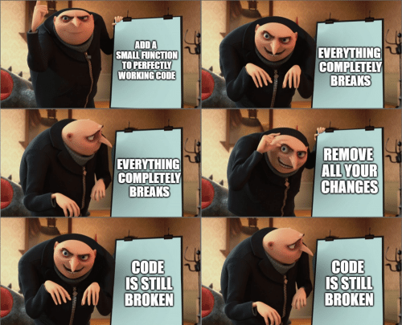

Imagine having a time machine that lets you not only travel back and forth through time, but across different parallel universes. And the best part is that this machine lets you merge the best parts of those alternate realities into your main timeline. This is what git lets you do (for code, at least).

Then again, git is incredibly powerful, so the multiverse feature is probably in there somewhere, too...

## What is Git?

> Git is a free and open source distributed version control system designed to handle everything from small to very large projects with speed and efficiency. 

### Version Control Systems
Okay, but what does that mean? In short, a <b>Version-Control System (VCS)</b> is a tool that allows you to take snapshots of your files as you work on them. If you are writing code (or anything, really) without a VCS, you are missing out on an insanely useful safety net. A VCS gives you the freedom to experiment with changes to your code without the risk of not being able to recover a useable state. You can always roll back to previous versions of your files!

### Distributed
What does it mean that git is <b>distributed</b>? It means that there is no mandated central repository. Every repository is completely self-sufficient and can stand alone on a user's filesystem. A git repository is just a regular folder on your filesystem plus the repository information.*

You can use git completely effectively on your own computer, without ever syncing your changes with some other server. Other VCS tools have a central server that requires you to have a connection before you can make a commit. Additionally, some VCSes require users to check files out in order to edit them. This prevents people from making changes to the same file at the same time, thus avoiding potential conflicts, but also requiring greater communication about who has what files checked out.

Git takes a different approach. Because it is distributed, it is possible for two (or more) developers to be editing the same file at the same time because the files live on each developer's system.

"Madness!" you say, "Won't that cause all sorts of problems??" 

For the most part, no. Git is smart about automatically merging changes. Even if multiple people have changed the same file, git will usually know how to merge those changes together.

## Why is Git Amazing?
Git is very _useful_ for a variety of reasons. As with other VCSes, it makes collaboration on projects possible. It also provides users with a way to revert back to previous versions. But that's not why git is *amazing*. To understand why git is so good, I think it's helpful to talk about why things are so awful without git.

### It's a Safety Net
When I was in college I was not yet using any kind of VCS. Programming assignments were a challenge. Very few things are more frustrating than getting something to work, breaking it, and then not being able to get back to a working state.

As a result, I was a lot more hesitant to refactor my code as I was working. If you worry that changing your code will break it, and that you won't be able to *at least* get back to how it was before, most people will be less likely to refactor. This goes for adding features and changing the logic of your code, as well.

Using git is such a freeing feeling. You can commit your code at any time, and you can always recover a previous state. You don't have to worry about not being able to get your working code back; you can just checkout the last commit you made.

Git also makes it really easy to see _what was changed_ between your current code and the last commit. If you did indeed break something, git will show you what changed. That can be invaluable when you are trying to figure out what you need to fix.

### Branching
Being able to go back in time is certainly useful, but git takes this even further and allows you to keep different branches of your code. This is where the multiverse metaphor comes in. You can start from one main version of your code and create different branches for experimentation without affecting your main branch. Once you deem an experiment to be successful you can merge those changes in to your main branch.

Imagine you have an application, and you want to add a tab to it. With git, you can create a branch for this new feature. 

It's important to note that this merging process generally requires little-to-no manual intervention. It is *not the same* as keeping multiple versions of your files and manually piecing them together or remembering which one was the good one! Gone are the days of `your_code.py`, `your_code_final.py`, `your_code_final_not_working.py`, `your_code_final_2.py`, etc.

### Asynchronous/Distributed Collaboration
Back to the distributed thing for a minute. It may seem like a small thing, but it's actually really important. Remember that with git you do not need a connection to a central server to be able to make commits. With something like SVN, if you have no internet connection you cannot make commits. This is because commits happen on some remote server, not on your computer.

